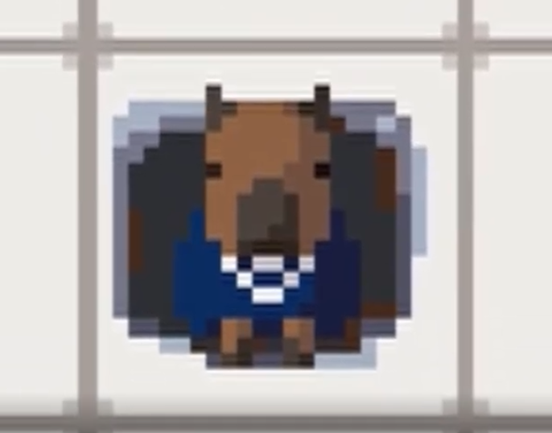
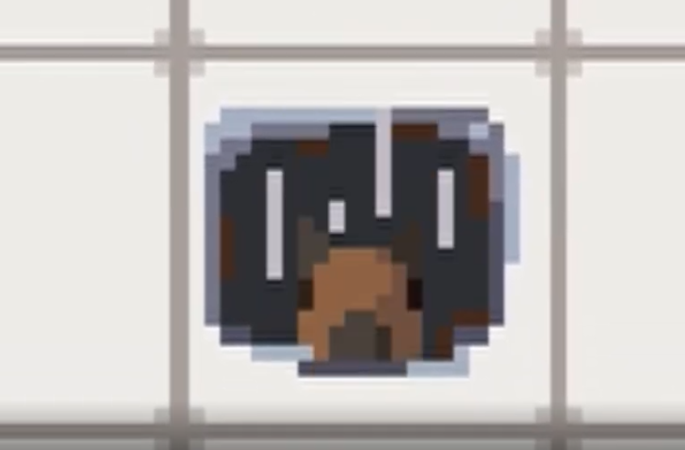
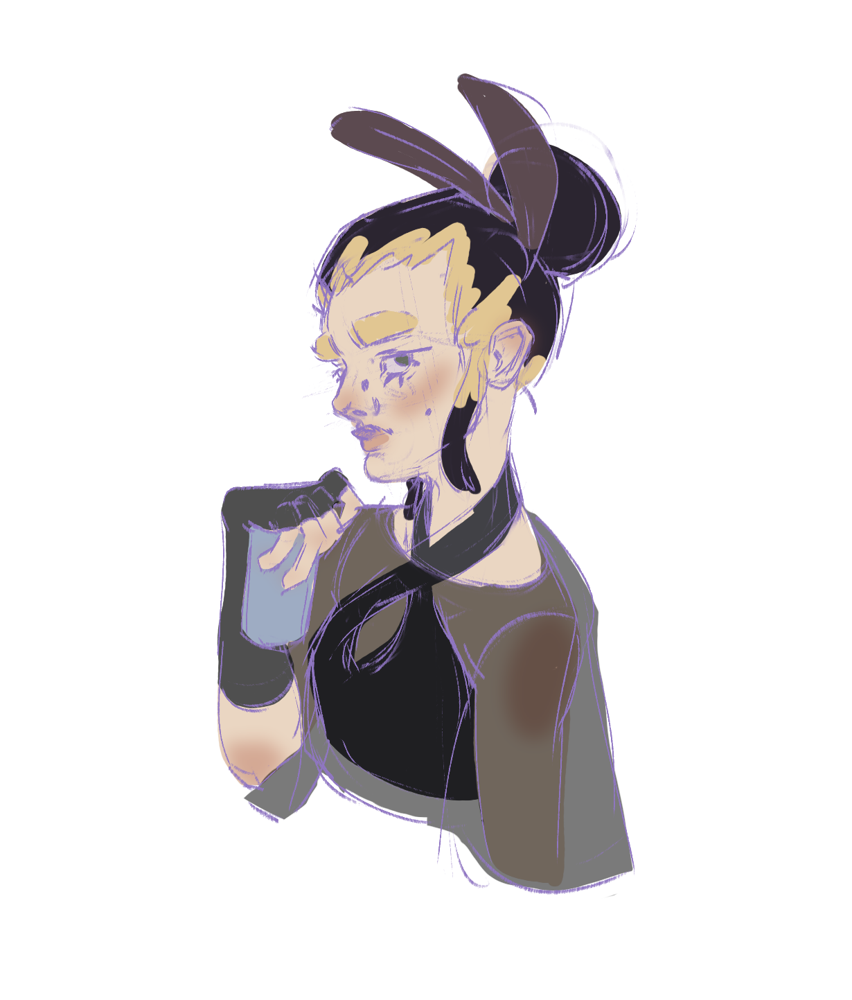

# Capybara Escape 🙄

# O projekcie

Capybara Escape to interaktywna gra wieloosobowa, której celem jest uwolnienie kapibary Caprisuna z czeluści serwerowni.
Pomagają w tym odwieczni wyjadacze koła Sol oraz Vron, o których możesz się dowiedzieć więcej śledząc na bieżąco nasze postępy

<p align="center">
  
  
</p>

# Bohaterowie

<table width="100%">
  <tr>
    <td width="50%" align="center" valign="top">
      
      <h3>Sol</h3>
      <p>Uosobienie słonecznego dnia, jak nie samego słońca.</p>
    </td>
    <td width="50%" align="center" valign="top">
      
      <h3>Vron</h3>
      <p>Wiecznie zmęczona, chaotyczna, mimo ciemnej otoczki bardzo troskliwa.</p>
    </td>
  </tr>
</table>

## Uruchomienie

```
git clone https://github.com/Solvro/web-capybara-escape.git
cd web-capybara-escape
npm install
npm run dev
```

Pierwsze `npm install` instaluje zależności client i server. Narzędzia w root husky, prettier itd. również są instalowane oraz uruchamia się `prepare` - hooki Gita wymagają instalacji w tym właśnie katalogu. Front i backend startują razem dzięki `concurrently`.

I to tyle, możesz testować lokalnie nasz domyślny poziom 🥱

## Skrypty w katalogu głównym

| Skrypt                 | Opis                                                                   |
| ---------------------- | ---------------------------------------------------------------------- |
| `npm run dev`          | Uruchamia serwer i klienta równolegle.                                 |
| `npm run format`       | Uruchamia Prettier na folderach client i server oraz nadpisuje pliki.  |
| `npm run format:check` | To samo co wyżej, ale tylko sprawdza formatowanie (bez zapisu)         |
| `npm run test`         | Odpala testy.                                                          |
| `npm run prepare`      | Uruchamiane automatycznie po `npm install` - Husky podpina hooki Gita. |

## Commity i konwencja wiadomości

Wiadomości commitów muszą przechodzić **commitlint**. Stosujemy **[Conventional Commits](https://www.conventionalcommits.org/)** - krótki wzorzec:

```
<typ>(opcjonalny-zakres): krótki opis w trybie rozkazującym
```

Typy używane: `feat`, `fix`, `chore`, `docs`, `refactor`, `test`

Hook **`commit-msg`** odrzuci commit, jeśli opis nie spełni reguł

## Sprawdzanie błędów lokalnie

Sprawdzaj lokalnie czy działa 😉

```bash
npm run format:check
npm run test:server
npm run build --prefix client
npm run build --prefix server
```

**Husky:** przed commitem odpalane są `lint-staged` oraz `npm run test:server`. Commit nie przejdzie dopóki nie zostaną naprawione błędy

## Baza danych

Do połączenia z bazą danych wymagane są poniższe zmienne środowiskowe

- `MONGODB_URI`
- `MONGODB_DB_NAME`
- `ADMIN_API_TOKEN`
- `DEFAULT_LEVEL_SLUG` (opcjonalnie)

### Export poziomów do Mongo

Pliki poziomów z `server/src/rooms/json/examples` (wyłączając `default.json`) zostaną wyeksportowane do kolekcji `levels`:

```bash
npm run export:levels          # pomija poziomy, które istnieją już w bazie
npm run export:levels:force    # nadpisuje istniejące poziomy
```

Tworzy nowe zasoby w bazie bazując na slugu
`default.json` - jest używany offline, gdy baza nie jest podłączona

## Stack

- [Colyseus.io](https://docs.colyseus.io/) - biblioteka po stronie serwera
- [Phaser](https://phaser.io/) - biblioteka do renderowania obiektów po stronie frontendu
- [React](https://react.dev/)
- [TypeScript](https://www.typescriptlang.org/)
- [MongoDB](https://www.mongodb.com/) - baza dla naszych poziomów

---

<p align="center">Made with 💕 by <a href="https://github.com/Solvro">Solvro</a></p>
<p align="center" style="margin-left: 20px; margin-top:-30px">
  
</p>
